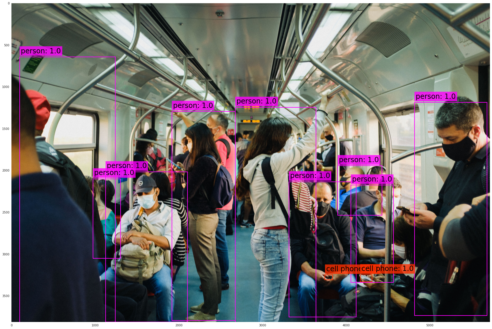

# FIAP MBA em Machine Learning e Inteligência Artificial

Informações sobre o curso acesse [aqui](https://www.fiap.com.br/mba/).



Este repositório reúne todos os notebooks, imagens, modelos e demais materiais necessário para a condução das aulas e revisão das mesmas.

Utilize o [issues](https://github.com/FIAPON/fiap-ml-visao-computacional/issues) para relatar algum problema.

Como é um repositório público, aceito eventuais Pull Requests!

## Visão Computacional

Nas aulas podemos utilizar o Google Colab, os Notebooks do Kaggle ou a própria distribuição local Anaconda, com uso do Jupyter Notebook, que há vem instalado nesta distribuição. Você também pode usar até mesmo o VSCode, escolha o ambiente que mais adeque ao seu estilo!

Para instalar o Anaconda, acesse a sessão de [Downloads](https://www.anaconda.com/download) do Anaconda.

Tanto o [Google Colab](https://colab.research.google.com/) ou [Kaggle](https://www.kaggle.com/) podem ser acessados diretamente dos respectivos sites.

Para quem for usar Colab ou Kaggle, use o _badge_ de cada um. Eles possuem um link que já abre direto em cada plataforma, levando em consideração as particularidades de cada ambiente.

## Uso de câmeras

Em algumas aulas poderá ser utilizado o _streaming_ de vídeo de câmeras, que somente funciona em instalações locais. Tanto Google Colab quanto Kaggle ainda não suportam câmeras no modo ao vivo (exceto Colab que suporte imagens estáticas) por serem ambientes virtualizados.

Veja [esta](https://github.com/michelpf/fiap-ml-tec-proc-imagens/blob/master/util/videos-camera-mac-windows.ipynb) rápida introdução do uso de câmeras com o OpenCV em MacOS e Windows. Guarde esse pequeno guia para futuros usos, pois no MacOS as coisas funcionam um pouco diferente do Windows e costumam travar 😕 .

### Pacotes utilizados

Base comum a todas as aulas:

* [OpenCV](https://opencv.org/) (```pip install opencv-contrib-python==5.0.0.93```)
* [NumPy](https://numpy.org/) (```pip install numpy```)
* [Matplotlib](https://matplotlib.org/) (```pip install matplotlib```)
* [Seaborn](https://seaborn.pydata.org/) (```pip install seaborn```)
* [Scikit Learn](https://scikit-learn.org/stable/) (```pip install scikit-learn```)
* [Scipy](https://scipy.org/) (```pip install scipy```)

Pacotes específicos, instalados dentro do próprio notebook de cada aula:

* Aula 2 — [EasyOCR](https://github.com/JaidedAI/EasyOCR) (```pip install easyocr```)
* Aula 3 — [qrcode](https://pypi.org/project/qrcode/) e [pyzbar](https://pypi.org/project/pyzbar/) (```pip install qrcode pyzbar```)
* Aula 4 — [Dlib](http://dlib.net/), [MediaPipe](https://ai.google.dev/edge/mediapipe) (```pip install mediapipe==0.10.31```)
* Aula 5 — [PyTorch](https://pytorch.org/), [Ultralytics](https://docs.ultralytics.com/) (YOLO11), [Transformers](https://huggingface.co/docs/transformers), [Diffusers](https://huggingface.co/docs/diffusers), [DeepFace](https://github.com/serengil/deepface) (```pip install deepface==0.0.74```), além de ```supervision```, ```roboflow```, ```visualkeras``` e ```tf-explain```

_No Google Colab todas as dependências já estão instaladas. Já no Kaggle está indicando como instalar as dependências, sem dificuldades._ 😄

_A Aula 5 usa modelos maiores (YOLO11, DETR, CLIP, Stable Diffusion e SAM). Rode em ambiente com GPU — no Colab, ative o acelerador em `Ambiente de execução > Alterar o tipo de ambiente de execução`._ 🚀

Aulas no programa atualizado da disciplina:

## Introdução a visão computacional (Aula 1)

### Introdução sobre visão computacional e processamento de imagens

1. Introdução do OpenCV
2. Instalação
3. Formação de imagens
4. Espaços de cores (RGB, escala de cinza, HSV e LAB)
5. Histogramas, equalização e comparação de imagens
6. Construção de imagens (formas geométricas e textos)

[](https://colab.research.google.com/github/FIAPON/fiap-ml-visao-computacional/blob/main/aula-1-introducao-visao-computacional/introducao_visao_computacional.ipynb)


### Desafio

1. Identificação de cores 
[](https://colab.research.google.com/github/FIAPON/fiap-ml-visao-computacional/blob/main/aula-1-introducao-visao-computacional/desafio-1/desafio-1.ipynb)


## Manipulação de imagens (Aula 2)

### Manipulação e transformação de imagens

1. Transformações afins
2. Translações
3. Rotações
4. Redimensionamento e interpolação
5. Transformação homográfica (não-afim)
6. Recorte de imagens e região de interesse (ROI)
7. Operações lógicas (_bitwise_) e filtro de cores em HSV
8. _Template matching_
9. Extra: OCR (Reconhecimento Óptico de Caracteres) com EasyOCR

[](https://colab.research.google.com/github/FIAPON/fiap-ml-visao-computacional/blob/main/aula-2-transformacao/transformacao-imagens.ipynb)

### Desafios

1. Transformação de imagens [](https://colab.research.google.com/github/FIAPON/fiap-ml-visao-computacional/blob/main/aula-2-transformacao/desafio-1/desafio-1.ipynb) 

   
2. Máscaras em imagens [](https://colab.research.google.com/github/FIAPON/fiap-ml-visao-computacional/blob/main/aula-2-transformacao/desafio-2/desafio-2.ipynb)

   
3. Classificador de imagens de dia e noite (_pipeline_ de machine learning) [](https://colab.research.google.com/github/FIAPON/fiap-ml-visao-computacional/blob/main/aula-2-transformacao/desafio-3/desafio-3.ipynb)

4. Estudo de caso: reconhecimento de caracteres com histogramas de projeção [](https://colab.research.google.com/github/FIAPON/fiap-ml-visao-computacional/blob/main/aula-2-transformacao/estudo-caso-histograma/classifier_histogram.ipynb)


## Segmentação de imagens (Aula 3)

### Técnicas para segmentar e extrair artefatos e regiões de interesse de imagens

1. Ruídos em imagens
2. Suavização (média, mediana, gaussiano e filtros de ordem)
3. Limiarização simples, de Otsu e adaptativa
4. Operações morfológicas (dilatação e erosão)
5. Detecção de bordas (Sobel, Laplaciano e Canny)
6. Segmentação: crescimento de região, componentes conectados e contornos
7. Casca convexa (_convex hull_) e identificação de formas
8. Estudo de caso: manchas de óleo no Nordeste
9. Bônus: esteganografia com LSB

[](https://colab.research.google.com/github/FIAPON/fiap-ml-visao-computacional/blob/main/aula-3-segmentacao/segmentacao.ipynb)

### Desafios

1. Contornos em imagens [](https://colab.research.google.com/github/FIAPON/fiap-ml-visao-computacional/blob/main/aula-3-segmentacao/desafio-1/desafio-1.ipynb)

2. Limpeza de imagens [](https://colab.research.google.com/github/FIAPON/fiap-ml-visao-computacional/blob/main/aula-3-segmentacao/desafio-2/desafio-2.ipynb)

3. Contando Moedas [](https://colab.research.google.com/github/FIAPON/fiap-ml-visao-computacional/blob/main/aula-3-segmentacao/desafio-3/desafio-3.ipynb)


## Análise facial (Aula 4)

### Análise facial

1. Classificadores em cascata de Haar (Viola-Jones)
2. LBPH (_Local Binary Pattern Histogram_)
3. Detecção com YuNet e reconhecimento por _embeddings_ com SFace
4. Classificador de marcos faciais DLib e EAR (_Eye Aspect Ratio_)
5. Alinhamento de faces
6. MediaPipe FaceMesh, em imagem estática e em vídeo
7. _Face swap_: como funciona, aplicações legítimas, riscos e ética

[](https://colab.research.google.com/github/FIAPON/fiap-ml-visao-computacional/blob/main/aula-4-analise-facial/Valendo_de_classificacao_objetos_analise_facial.ipynb)

### Desafios

1. Detecção de sorriso [](https://colab.research.google.com/github/FIAPON/fiap-ml-visao-computacional/blob/main/aula-4-analise-facial/desafio-1/desafio-1.ipynb)
    
2. Classificação de emoções com marcos faciais [](https://colab.research.google.com/github/FIAPON/fiap-ml-visao-computacional/blob/main/aula-4-analise-facial/desafio-2/desafio-2.ipynb)


## Machine learning, deep learning e transfer learning aplicado a imagens (Aula 5)

### Reconhecimento de imagens e objetos

1. Técnicas de transferência de aprendizado (*transfer learning*) com VGG19
2. Detecção baseada em regiões (Faster R-CNN)
3. Reconhecimento de objetos com YOLO11 (You Only Look Once), incluindo _fine-tuning_ e análise de métricas
4. Vision Transformer (ViT) e DETR, detecção com Transformer
5. CLIP e classificação _zero-shot_
6. Geração de imagens com Stable Diffusion
7. SAM (Segment Anything), segmentação por clique
8. Síntese final: uma imagem, pipeline completo

[](https://colab.research.google.com/github/FIAPON/fiap-ml-visao-computacional/blob/main/aula-5-machine-learning-aplicado/reconhecimento_de_imagens_e_objetos.ipynb)


### Desafio

1. Detecção de Lixo em Ruas [](https://colab.research.google.com/github/FIAPON/fiap-ml-visao-computacional/blob/main/aula-5-machine-learning-aplicado/desafio-1/desafio-1.ipynb)
    

## Material extra

Conteúdo complementar, fora do programa das aulas. Usa o utilitário Darknet, abordagem anterior à do YOLO11 visto na Aula 5 — vale como referência histórica de como era feito o _transfer learning_ em detecção de objetos.

1. [Transfer Learning com YOLO e detecção de objetos](extra/yolo-transfer-learning-descriptors.ipynb)

## Capstones

Projetos de conclusão da disciplina aplicados.

1. [Análise de Imagens Médicas](https://github.com/michelpf/fiap-ml-visao-computacional-analise-imagens-medicas)
2. [Auditoria de Vídeo](https://github.com/michelpf/fiap-ml-visao-computacional-auditoria-video)
3. [Detector de Liveness](https://github.com/michelpf/fiap-ml-visao-computacional-detector-liveness)


## Agradecimentos:

Esse repositório é baseado no repositório do prof. Michel, agradecemos ao ceder o uso dos programas bases.
